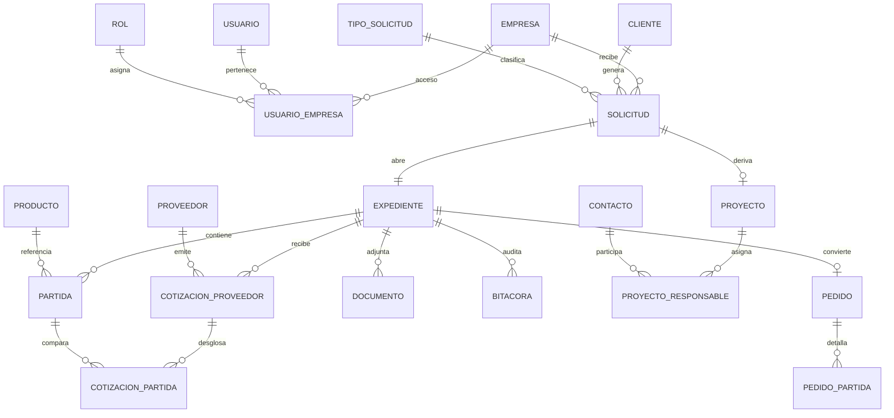

# YLIKA Platform — Plan Maestro (ERP / BOS / CRM)

> Documento de planificación. **No incluye código de aplicación.**  
> Versión: 1.0 · Agosto 2026

---

## 1. Respuestas directas a tus dudas

### 1.1 ¿Puedo hacer el repositorio privado y seguir desarrollando?

**Sí.** Es lo recomendado.

| Tema | Recomendación |
|------|----------------|
| Visibilidad | Pasar `Ylikadev-web/YLIKA` a **Private** en GitHub Settings → Danger Zone / Change visibility |
| Cursor Cloud | Funciona con repos privados del mismo owner/org (con permisos del agent) |
| shadcn/ui | **No clones** `shadcn-ui/ui` dentro de este repo. Úsalo como **referencia de componentes** vía CLI (`npx shadcn@latest add …`). El repo de shadcn es plantillas, no tu producto |
| Secretos | Nunca subas `.env`, passwords de DB, ni tokens. Usa GitHub Secrets / variables en el servidor |

### 1.2 ¿Necesitas una PC Linux central?

**No es obligatorio un PC de escritorio “central”.** Conviene un **servidor Linux** (puede ser mini-PC, VPS o NUC) dedicado a datos y runtime.

Arquitectura recomendada para tu caso:

```
[Tu laptop / Cursor Cloud]  →  git push (repo privado)
         │
         ▼
[Servidor Linux en oficina o VPS]
  ├── PostgreSQL (datos)
  ├── App (Docker: Next.js / API)
  ├── Almacenamiento documentos (disco o MinIO/S3)
  └── Cloudflare Tunnel → dominio oculto
         │
         ▼
https://app.distribuidoramone.com.mx  (o subpath /portal)
  (no expuesto por IP pública directa)
```

| Pieza | Dónde | Por qué |
|-------|--------|---------|
| Código | GitHub privado + Cursor | Colaboración, historial, agentes |
| Base de datos | Servidor Linux propio o managed Postgres | Control, backups, latencia baja |
| App web | Mismo servidor (Docker) o Cloudflare Workers+Containers más adelante | Un solo punto de despliegue |
| Dominio / TLS / ocultar origen | Cloudflare (ya lo tienes) | Tunnel + Access (Zero Trust) para no abrir puertos |
| Documentos (PDF, bases, cotizaciones) | Disco del servidor o R2/S3 | Expedientes pesados fuera de Postgres |

**Conclusión:** desarrolla desde este equipo (o Cursor Cloud); el Linux sirve como **hogar de datos y app**, no como estación de trabajo obligatoria.

### 1.3 Stack técnico sugerido (escalable, sin “cara de IA genérica”)

| Capa | Elección | Alternativa |
|------|----------|-------------|
| Frontend | **Next.js (App Router) + TypeScript + shadcn/ui** | — |
| Estilos | Tailwind + **tokens de marca YLIKA** (no tema default shadcn) | — |
| API | Route Handlers / tRPC o REST interno | — |
| Auth | Auth.js o Better Auth + roles RBAC | Cloudflare Access delante (VPN-like) |
| DB | **PostgreSQL 16** | Supabase self-host / Neon si prefieres managed |
| ORM | Drizzle o Prisma | — |
| Files | MinIO o Cloudflare R2 | carpeta `/data` con backups |
| Deploy | Docker Compose en Linux + Cloudflare Tunnel | — |

**¿Por qué PostgreSQL?**  
Expedientes con partidas, cotizaciones múltiples, roles, auditoría y reportes se modelan bien en relacional. JSONB ayuda para campos variables de bases de gobierno sin romper el esquema.

---

## 2. Contexto de negocio

### Grupo YLIKA — 3 empresas operativas

| Código | Empresa | Enfoque típico |
|--------|---------|----------------|
| `MONE` | Distribuidora de Materiales y Construcción Mone | Materiales / suministro |
| `DAKAM` | Dakam Developers | Desarrollo / proyectos |
| `NARAMO` | Soluciones de Estacionamiento Naramo | Estacionamientos / soluciones |

El sistema es **multi-empresa (tenant lógico por `empresa_id`)**: un usuario puede ver una o varias empresas según rol.

### Origen de la solicitud

1. **Gobierno** — CompraNet / convocatorias / adjudicaciones  
2. **Privado** — Cliente privado: proyecto o venta directa  

---

## 3. Tipos de solicitud (catálogo configurable)

Los tipos **no van hardcodeados en UI**: viven en tabla `tipo_solicitud` para poder agregar sin redeploy.

### 3.1 Gobierno — Adquisiciones (LAASSP, art. 35, reforma 2025)

Procedimientos oficiales a contemplar:

1. Licitación pública  
2. Invitación a cuando menos tres personas  
3. Adjudicación directa  
4. Diálogo competitivo  
5. Adjudicación directa con estrategia de negociación  
6. Asignación de contrato específico derivado de acuerdo marco  
7. Asignación de órdenes de suministro (Tienda Digital / catálogos electrónicos)  

**Alias operativos** que el equipo usa hoy (mapear al catálogo, no duplicar como ley distinta):

- Compra directa → suele corresponder a **Adjudicación directa** (por monto o excepción)  
- Adquisición de bienes → **objeto** de la contratación (bienes / servicios / arrendamiento), no un procedimiento aparte  

Campos adicionales gobierno:

- Carácter: Nacional / Internacional / Internacional bajo TLC  
- Número de procedimiento CompraNet  
- Entidad convocante  
- Fechas: publicación, junta aclaraciones, apertura, fallo  
- % contenido / integración nacional requerido y ofertado  
- Origen del bien (país)  
- Criterio de evaluación (binario / puntos y porcentajes / costo-beneficio)

### 3.2 Gobierno — Obra pública (LOPSRM, art. 27)

1. Licitación pública  
2. Invitación a cuando menos tres personas  
3. Adjudicación directa  

### 3.3 Privado

1. Proyecto  
2. Venta directa  

---

## 4. Flujo operativo del expediente (núcleo del sistema)

```
Nueva solicitud
  → Empresa destino (MONE | DAKAM | NARAMO)
  → Sector (Gobierno | Privado)
  → Tipo de solicitud (catálogo)
  → Cliente / Convocante
  → Crear EXPEDIENTE (código único)
       → Cargar LISTA LIMPIA (partidas)
       → Solicitar / adjuntar COTIZACIONES por proveedor
       → Comparativo (precio, entrega, % nacional, origen, condiciones)
       → Selección / propuesta
       → Pedido / OC / contrato (si procede)
       → Entrega / cobranza / cierre
```

Cada transición deja **bitácora** (quién, cuándo, qué cambió) + documentos adjuntos.

---

## 5. Modelo entidad-relación (sólido y extensible)

### 5.1 Diagrama lógico (Mermaid)



### 5.2 Entidades principales (campos clave)

#### Núcleo multi-empresa / acceso

- **empresa** — id, codigo (`MONE`…), razon_social, rfc, logo_url, activa  
- **usuario** — id, email, nombre, hash/auth_provider, activo  
- **rol** — id, codigo (`ADMIN`, `COMERCIAL`, `COMPRAS`, `COBRANZA`…), permisos JSON  
- **usuario_empresa** — usuario_id, empresa_id, rol_id  

#### Catálogos

- **tipo_solicitud** — sector (`GOBIERNO`|`PRIVADO`), ambito (`ADQUISICIONES`|`OBRA`|`PRIVADO`), codigo, nombre, activo, orden  
- **producto** — sku, descripcion, unidad, marca, categoria, especificacion  
- **unidad_medida** — PIEZA, M2, ML, KG…  

#### CRM / clientes

- **cliente** — tipo (`GOBIERNO`|`PRIVADO`), razon_social, rfc, dependencia (si gob), contacto principal, direccion, credito…  
- **contacto** — cliente_id nullable, nombre, puesto, email, telefono, area  

#### Solicitud → Expediente

- **solicitud**  
  - empresa_id, sector, tipo_solicitud_id, cliente_id  
  - titulo, folio_externo (CompraNet / referencia),  
  - fechas clave, monto_estimado, moneda, estatus  
  - meta JSONB (carácter, % nacional requerido, etc.)  
- **expediente**  
  - codigo único (`YLK-MONE-2026-00041`), solicitud_id, estatus_pipeline  
  - responsable_comercial_id, notas  

#### Partidas y lista limpia

- **partida**  
  - expediente_id, numero, producto_id nullable, descripcion_libre  
  - cantidad, unidad, marca_solicitada, especificacion  
  - notas, orden  

Carga inicial: import CSV/XLSX → partidas (“lista limpia”).

#### Proveedores y cotizaciones

- **proveedor** — razon_social, rfc, contacto, condiciones_pago default  
- **cotizacion_proveedor** — expediente_id, proveedor_id, fecha, vigencia, archivo_id, tiempo_entrega_global, condiciones, moneda  
- **cotizacion_partida** — cotizacion_id, partida_id, precio_unitario, moneda, tiempo_entrega_dias,  
  pct_contenido_nacional, pais_origen, marca_ofertada, notas, seleccionado_bool  

El comparativo se calcula en lectura (vista/materialized) sobre `cotizacion_partida`.

#### Proyectos (privado / obra)

- **proyecto** — expediente_id o solicitud_id, nombre, estatus, fechas, presupuesto  
- **proyecto_responsable** — proyecto_id, contacto_id o usuario_id, area (`COMERCIAL`,`TECNICA`,`COMPRAS`,`OBRA`,`FINANZAS`), rol_en_proyecto, primario_bool  

#### Pedido / post-venta

- **pedido** — expediente_id, cliente_id, empresa_id, folio, estatus, totales  
- **pedido_partida** — pedido_id, partida_id, cantidad, precio_acordado, proveedor_id  

#### Documentos y auditoría

- **documento** — entidad_tipo, entidad_id, tipo (`BASE`,`LISTA_LIMPIA`,`COTIZACION`,`FALLO`,`CONTRATO`,`OC`,`OTRO`), storage_key, nombre, uploaded_by, created_at  
- **bitacora** — entidad_tipo, entidad_id, usuario_id, accion, diff JSONB, created_at  

---

## 6. Menú: lo que está bien + submenús recomendados

La lista plana de tu jefe es un **buen mapa de dominios**. Para desarrollo y operación conviene **submenús** (información architecture), no más pantallas sueltas.

| # | Módulo | Submenús sugeridos |
|---|--------|---------------------|
| 1 | **Inicio** | Resumen por empresa · Tareas mías · Alertas de fechas (junta/fallo/entrega) |
| 2 | **Comercial** | Solicitudes · Expedientes · Comparativo de cotizaciones · Propuestas |
| 3 | **Compras** | Proveedores · Solicitudes de cotización · Órdenes de compra · Seguimiento |
| 4 | **Entregas** | Programadas · En tránsito · Recibidas · Incidencias |
| 5 | **Clientes y Cobranza** | Clientes · Contactos · Facturas / CXC · Estados de cuenta |
| 6 | **Admin y Tesorería** | Caja · Pagos a proveedores · Conciliación · Reportes |
| 7 | **Proyectos** | Tablero · Detalle · Responsables · Avances · Documentos |
| 8 | **Licitaciones** | Pipeline CompraNet · Calendario · Requisitos · Fallos |
| 9 | **Obra Pública** | Procedimientos LOPSRM · Expedientes obra · Estimaciones |
| 10 | **Documentos** | Explorador por expediente · Plantillas · Búsqueda |
| 11 | **Configuración** | Empresas · Usuarios/Roles · Tipos de solicitud · Productos · Integraciones |

**Ajuste de mapeo (importante):**

- **Licitaciones** y **Obra Pública** son especializaciones de **Solicitud/Expediente** con campos y pipelines distintos — no inventarios separados sin relación.  
- **Comercial** es la puerta de entrada de casi todo (alta de solicitud).  
- Evitar duplicar “expediente” en 4 menús: un expediente tiene **vistas** filtradas por módulo.

---

## 7. Dirección visual (anti-genérico IA)

### Identidad (desde logo YLIKA)

| Token | Uso |
|-------|-----|
| Negro / carbón profundo | Shell, sidebar, momentos de marca |
| Teal `#0AA3A8` | Primario / navegación activa / links |
| Naranja `#F39200` | CTA / estado “requiere acción” |
| Amarillo `#FFD100` | Acentos puntuales / highlights |
| Gris claro `#E8EAED` | Superficies de trabajo (no “cream AI”) |
| Tipografía | **Sora** o **Manrope** (UI) + **IBM Plex Sans** (números/tablas). Evitar Inter/Roboto |

### Principios de UI

1. **Una composición por pantalla**, no dashboard sobrecargado en el home.  
2. **Marca visible** en login y shell (logo YLIKA), sin sobreponer badges.  
3. **Tablas densas y legibles** (ERP real): partidas, comparativos — no cards decorativas.  
4. **shadcn = componentes**, no estética default. Re-theme completo con CSS variables.  
5. Motion sobrio: transición de sidebar, reveal de filas al cargar comparativo, feedback al guardar.  
6. Evitar: purple gradients, glow, pills excesivos, stats strips en hero, emojis en UI.

Wireframes y muestras: ver PDF `docs/YLIKA-Propuesta-Visual.pdf`.

---

## 8. Fases de desarrollo (técnicas, sin calendarios)

| Fase | Entregable | Dependencias |
|------|------------|--------------|
| **0 — Cimientos** | Repo privado, Docker Compose (app+Postgres), Cloudflare Tunnel, auth+roles, multi-empresa | Dominio + Linux |
| **1 — Expediente MVP** | Alta solicitud → expediente → partidas (lista limpia) → docs | Fase 0 |
| **2 — Cotizaciones** | Proveedores, carga cotizaciones, comparativo, % nacional/origen | Fase 1 |
| **3 — Proyectos & responsables** | Asignaciones por área, bitácora, contactos | Fase 1 |
| **4 — Pedido → entrega → cobranza** | Pipeline post-adjudicación | Fase 2 |
| **5 — Licitaciones / Obra** | Calendarios, campos LAASSP/LOPSRM, alertas | Fase 2 |
| **6 — Tesorería / reportes** | CXC, pagos, exportes | Fase 4 |

---

## 9. Seguridad y “link oculto”

1. Subdominio o path no publicitado (`app.` o `/ops`).  
2. **Cloudflare Access** (email OTP / SSO) delante de la app.  
3. Roles internos finos (módulo × empresa × acción).  
4. Auditoría obligatoria en expediente.  
5. Backups diarios de Postgres + documentos (offsite).  

---

## 10. Decisiones pendientes (para validar contigo / tu jefe)

1. ¿Postgres en mini-PC oficina o VPS?  
2. ¿Un solo login YLIKA con switch de empresa, o URLs por empresa?  
3. ¿La “lista limpia” siempre llega en Excel, o también captura manual?  
4. ¿Montos y moneda siempre MXN o multi-moneda?  
5. ¿Facturación electrónica (CFDI) en fase temprana o después?  

---

## 11. Archivos de este entregable

| Archivo | Contenido |
|---------|-----------|
| `docs/PLAN-YLIKA.md` | Este plan + ER + menú + stack |
| `docs/YLIKA-Propuesta-Visual.pdf` | Propuesta visual liviana (wireframes por módulo) |
| `Designer.png` | Logo de marca (ya en repo) |

**Siguiente paso acordado:** validar este modelo y el menú con submenús; después sí iniciar Fase 0 (sin reinventar pantallas).
